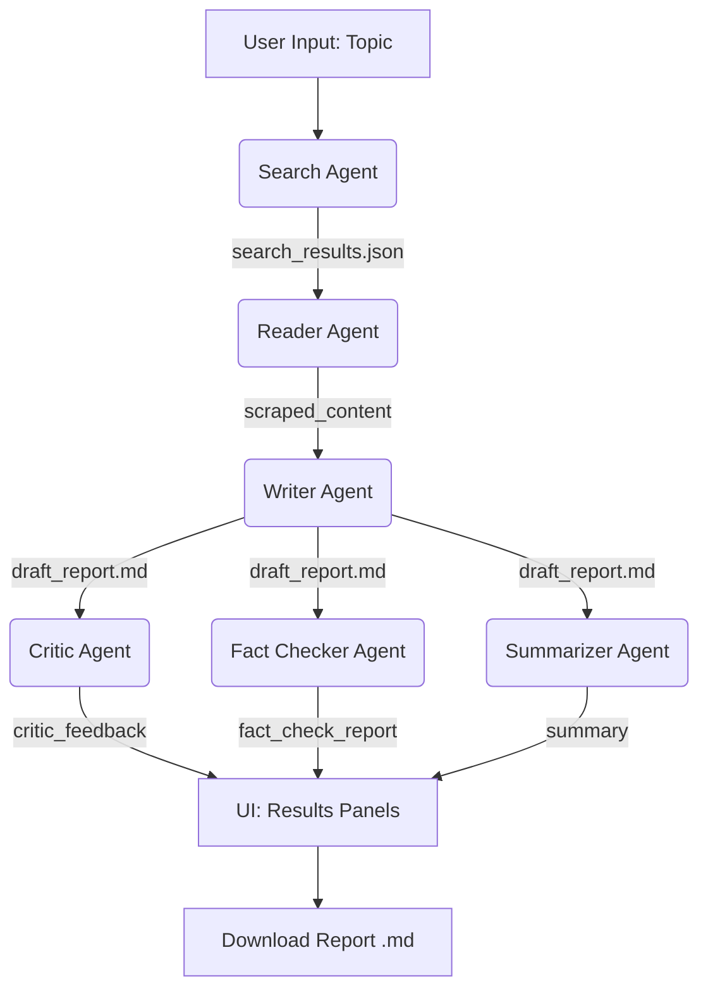

# ResearchMind

> Transform any topic into a polished, verified research report with six specialized AI agents running on **free Groq‑Cloud LLMs**.

 

---

## 📖 Overview

**ResearchMind** is an open‑source multi‑agent research assistant that orchestrates six AI agents to:

1. Search the web for reliable, recent sources.
2. Scrape in‑depth content from the best sources.
3. Compose a comprehensive, structured research report.
4. Critic the draft for accuracy, completeness, and clarity.
5. Fact‑check every claim against original sources.
6. Summarise the report into a crisp executive summary.

All agents run on **free Groq‑Cloud models** (Llama 3.2, Llama 3.1, Mixtral), making the system **entirely cost‑free** and lightning‑fast.

A modern, dark‑themed Streamlit interface lets you watch each step execute in real time (step‑by‑step mode) or run the whole pipeline at once (fast mode).

---

## 🔁 Workflow – Step‑by‑Step with Data Flow

1. **Search Agent**  
   **Input:** `topic` (string)  
   **Action:** Queries the web and returns a structured JSON list of sources.  
   **Output:** `search_results` (JSON) → also parsed into a **Pandas DataFrame** with columns: `title`, `url`, `snippet`, `reliability_score`.

2. **Reader Agent**  
   **Input:** `sources_df` (DataFrame) – the top‑2 URLs by reliability score.  
   **Action:** Scrapes the full content of those pages.  
   **Output:** `scraped_content` (string) – the complete text from the best sources.

3. **Writer Agent**  
   **Input:** `topic`, `search_results`, `scraped_content` (all strings).  
   **Action:** Generates a structured Markdown report (Introduction, Key Findings, Analysis, Conclusions).  
   **Output:** `draft_report` (Markdown string).

4. **Critic Agent**  
   **Input:** `draft_report`.  
   **Action:** Evaluates accuracy, completeness, and clarity – returns a score (1‑10) and a list of strengths/weaknesses.  
   **Output:** `critic_feedback` (string).

5. **Fact Checker Agent**  
   **Input:** `draft_report` + `search_results`.  
   **Action:** Cross‑references every factual claim with original sources, marking each as ✅ Verified, ❌ False, or ❓ Unverifiable.  
   **Output:** `fact_check_report` (string).

6. **Summarizer Agent**  
   **Input:** `draft_report`.  
   **Action:** Condenses the report into a 3‑5 sentence executive summary.  
   **Output:** `summary` (string).

> **Note:** Steps 4, 5, and 6 depend only on the Writer’s output, so they could run in **parallel** in a future optimisation.

**Pipeline diagram** (shows the exact flow of data between agents):

---
